## 自动化测试实践报告
## 环境选择
- 游戏：王者荣耀
- 平台：Android安卓
### 测试用例  
- 王者荣耀性能测试用例具体内容见[性能测试用例.pdf](../测试用例/性能测试用例.pdf)。
- 思维导图：
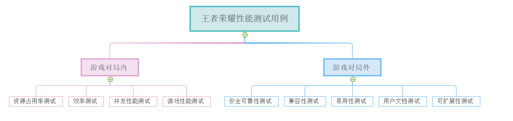
### 测试工具
- 游戏对局外测试用例  
进行以上游戏对局外的测试用例，如安全可靠测试等，不必采用过多工具，可以自己使用手机测试，也可以使用模拟各种手机型号测试（这些此处我就不一一测试，着重测试性能方面），甚至可以使用python自己编写代码进行测试，在`开发`中有我在这一方面进行的尝试。  
- 游戏对局内测试用例
进行以上游戏对局内测试用例，如游戏帧率等，可以采用现有的自动化测试工具`perfdog`来实现对游戏性能的测试。  
  - 使用方法
    - 步骤1   
    在Window PC机器上安装、运行PerfDog客户端。  
    同时，开启手机Debug调试模式及允许USB安装。
    - 步骤2  
    启动PerfDog，然后USB连接手机，自动检测添加手机到应用列表中。  
    有两种模式：  
      - 安装模式：需要在手机上自动安装PerfDog.apk，手机屏幕上有实时性能数据显示。（请开启Debug调试模式、允许USB安装和PerfDog悬浮窗管理权限）     
      效果如图左上角：  
      
      - 非安装模式：手机即插即用，无需任何设置及安装，使用非常简单，但手机屏幕上没有实时性能数据显示。
    - 步骤3  
    测试模式：
      - USB模式测试：USB连线，在设备列表选择USB图标设备进行USB模式测试(插线模式测试功率无任何意义)
      - WIFI模式测试(测试功率)：USB连线后，在设备列表选择WIFI图标设备进行WIFI模式测试。WIFI检测连接成功后，拔掉USB连接线。  
      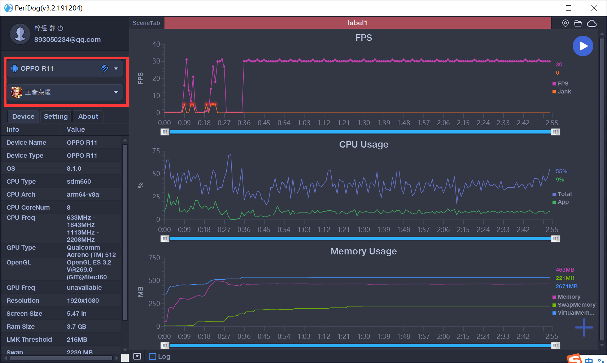    
    - 步骤4：  
    选择测试的游戏&应用。  
    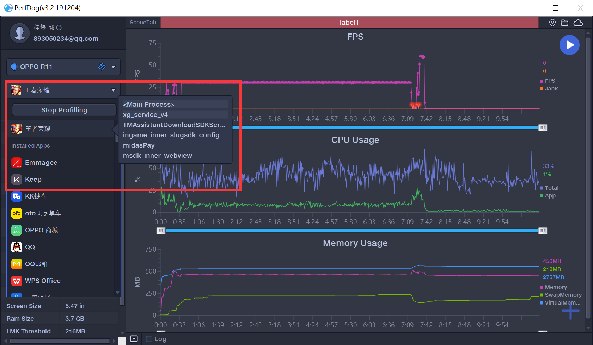    
    - 步骤5：  
    点击右下角＋号，选择测试项目。然后点击右上角开始测试的箭头符号进行测试。  
    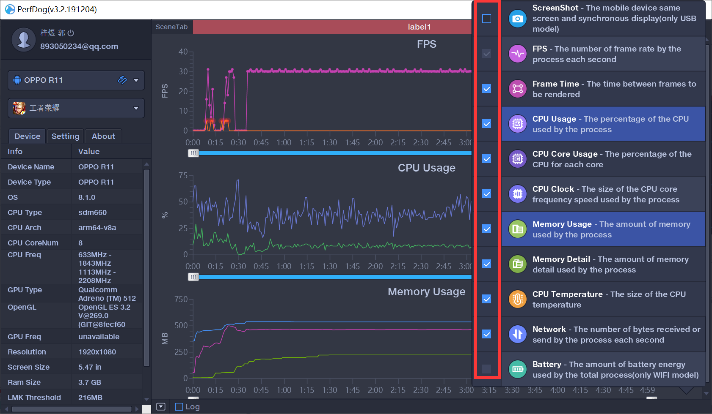  
    - 步骤6：  
    测试完毕后，点击右上角按钮停止，并保存数据，可选择上传到云端或者保存到本地Excel表格。  
    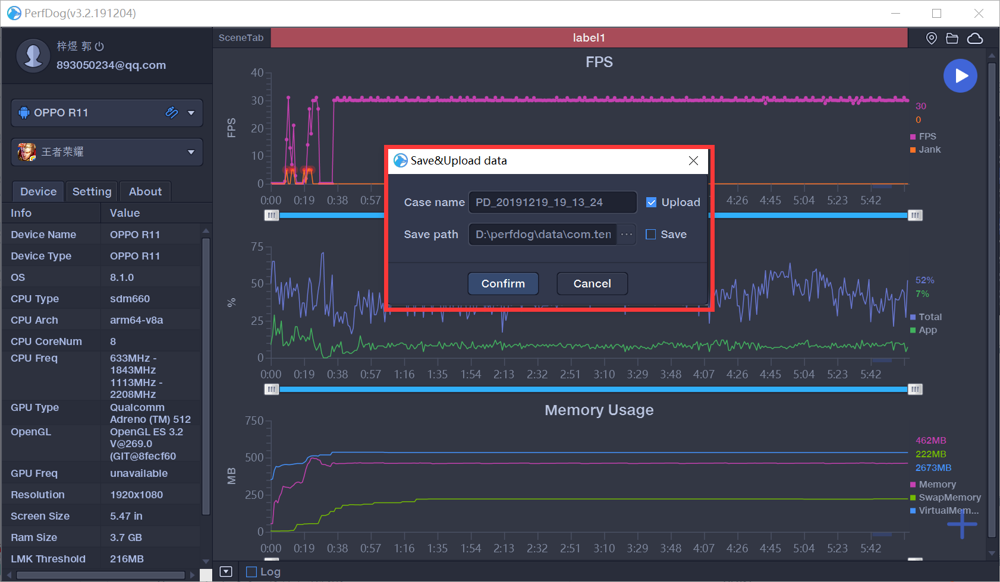  
### 性能指标
- 性能指标可参照[性能测试用例.pdf](../测试用例/性能测试用例.pdf)中指标以及详细解释。
- 此处着重列举重点测试指标及其具体的含义
  - Screenshot：屏幕截图  
  - FPS:1秒内游戏画面或者应用界面真实平均刷新次数，俗称帧率/FPS  
     1) Avg(FPS):平均帧率(一段时间内平均FPS)  
     2) Var(FPS):帧率方差(一段时间内FPS方差)  
     3) Drop(FPS):降帧次数(平均每小时相邻两个FPS点下降大于8帧的次数)  
  - Jank：1s内卡顿次数。  
    &emsp;类似Android的Jank卡顿和iOS的FramePacing平滑度统计原理。帧率FPS高并不能反映流畅或不卡顿。比如：FPS为50帧，前200ms渲染一帧，后800ms渲染49帧，虽然帧率50，但依然觉得非常卡顿。同时帧率FPS低，并不代表卡顿，比如无卡顿时均匀FPS为15帧。所以，平均帧率FPS与卡顿无任何直接关系)  
    PerfDog计算方法：同时满足两条件，则认为是一次卡顿Jank.  
    1、 当前帧耗时>前三帧平均耗时2倍。  
    2、 当前帧耗时>两帧电影帧耗时(1000ms/24*2=84ms)。  
    同时满足两条件，则认为是一次严重卡顿BigJank.  
    1、 当前帧耗时>前三帧平均耗时2倍。  
    2、 当前帧耗时>三帧电影帧耗时(1000ms/24*3=125ms)。  
     - BigJank:1s内严重卡顿次数
     - Jank(/10min):平均每10分钟卡顿次数。
     -  BigJank(/10min):平均每10分钟严重卡顿次数
  - FTime：上下帧画面显示时间间隔，即认为帧耗时，iOS9.1以下系统暂时不支持。   
     1) Avg(FTime):平均帧耗时  
     2) Delta(FTime):增量耗时(平均每小时两帧之间时间差>100ms的次数)  
  - CPU Usage：Total整机/App目标进程，统计结果和Android Studio Profiler一致
  - CPU Clock：各个CPU核心的频率和使用率
  - Memory：PSS Memory，统计结果和Android Java API标准结果一致，与Meminfo也一致。  
  - Memory Detail：NativePSS、GFX、GL、Unknown
  - Network：Recv/Send
  - CTemp：CPU温度
  - Battery Power：Current电流、Voltage电压、Power功率（注：与仪器测试误差<3%左右）
  - Log：系统调试日志信息
### 测试过程
- 按照工具中perfdog的使用方法，将手机与电脑连接，打开USB调试，确保手机与perfdog成功连接。  
- 勾选测试的内容，点击右上角的按钮开始测试。
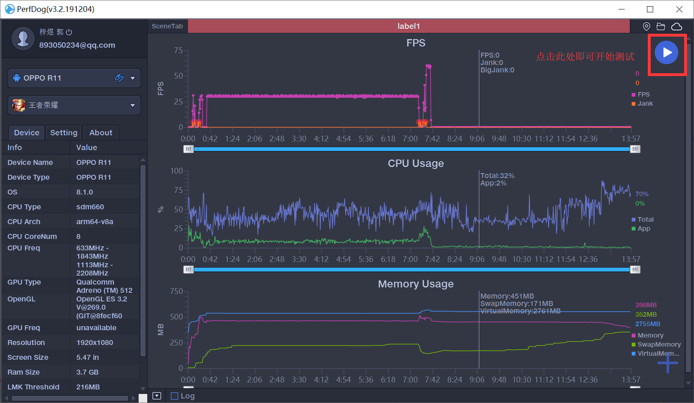  
- 测试结束后点击按钮暂停，并将测试结果数据保存在云端及本地Excel文件中。  
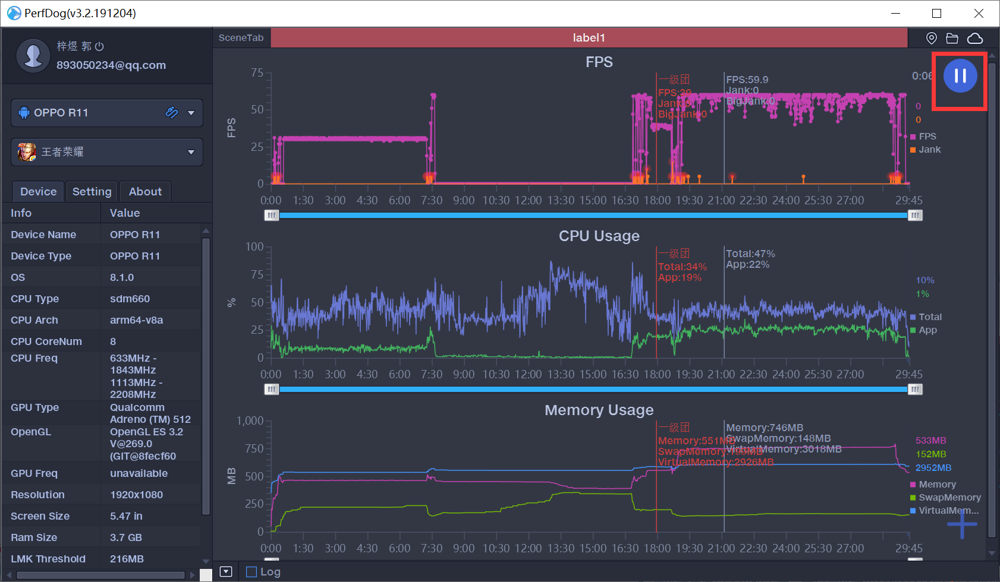  
- 登陆perfdog网站查看测试结果  
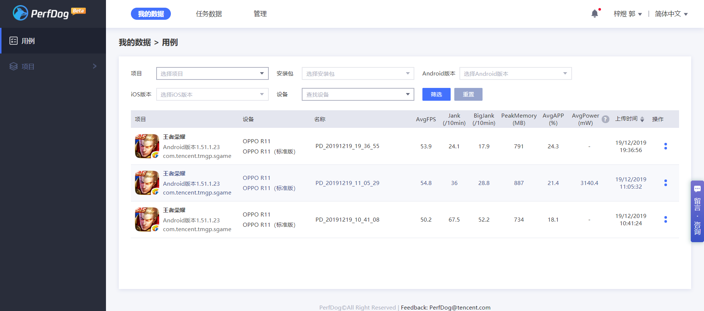   
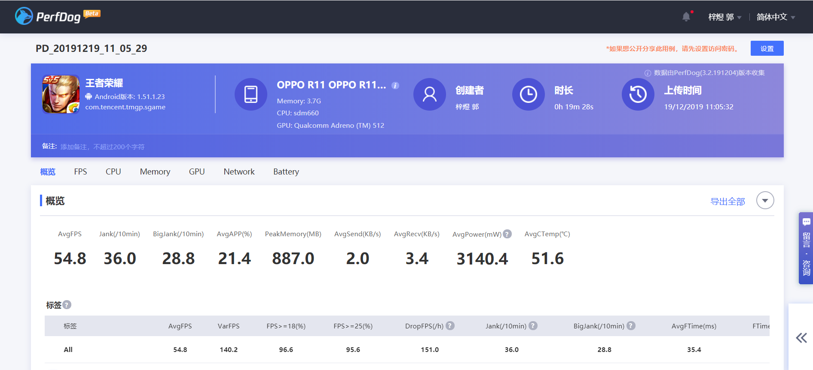  
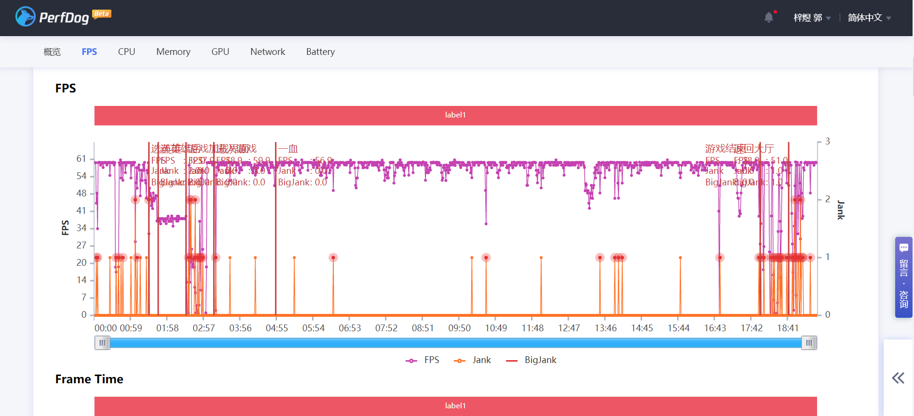    
其中，不只有FPS的图还有其他性能指标的图，此处就不一一展示。详见提交文件夹中。  
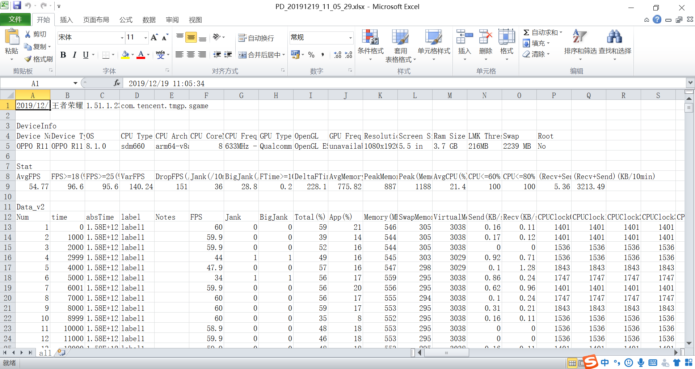    
不仅可以查看表格，其中的数据也都记录在了Excel文件中。  

### 开发  
做安卓手游测试的时候，adb是常用工具，我们可以通过它，进行apk的安装，卸载，截图，获取APK信息，性能数据，获取手机信息等等操作。同时编写python代码来进行测试。  
- 获取当前运行在前台的apk的package和activity名称
```py
def run_cmd(cmd):
    """执行CMD命令"""
    p = subprocess.Popen(cmd, stdout=subprocess.PIPE)
    return [i.decode() for i in p.communicate()[0].splitlines()]


def get_apk_info():
    """获取apk的package，activity名称

    :return: list  eg ['com.android.calendar', 'com.meizu.flyme.calendar.AllInOneActivity']
    """
    result = run_cmd("adb shell dumpsys activity top")
    for line in result:
        if line.strip().startswith('ACTIVITY'):
            return line.split()[1].split('/')

print(get_apk_info())

output: ['com.android.calendar', 'com.meizu.flyme.calendar.AllInOneActivity']
```
- 比如查看当前apk的内存占用
```py
def get_mem_using(package_name=None):
    """查看apk的内存占用

    :param package_name:
    :return: 单位KB
    """
    if not package_name:
        package_name = get_apk_info()[0]
    result = run_cmd("adb shell dumpsys meminfo {}".format(package_name))
    info = re.search('TOTAL\W+\d+', str(result)).group()
    mem = ''
    try:
        mem = info.split()
    except Exception as e:
        print(info)
        print(e)
    return mem[-1]

output: 37769
```
- 比如备份当前apk到桌面
```py
def backup_current_apk(path=r"C:\Users\jianbing\Desktop\apks"):
    package = get_apk_info()[0]
    result = run_cmd("adb shell pm path {}".format(package))
    cmd = "adb pull {} {}".format(result[0].split(":")[-1], os.path.join(path, "{}.apk".format(package)))
    print(cmd)
    run_cmd(cmd)
```
### 结果分析
- 查看测试结果，FPS，CPU，memory等各项性能指标在游戏对局过程维持相对稳定，对游戏体验没有过大的影响。
- FPS&Jank  
在选英雄后，FPS突然下降，而且在游戏加载界面FPS剧烈变化，并且发生多次卡顿现象。   
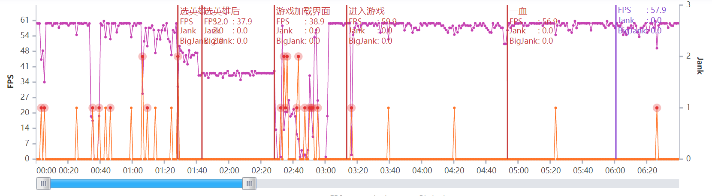  
同样的现象发生在游戏结束以及返回大厅的时候。  
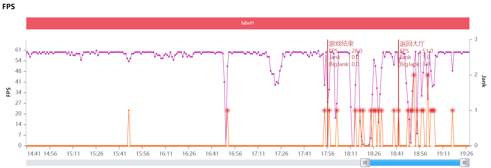    
个人分析认为，这是由于画面切换，或者游戏进程切换以及网络不稳定导致的FPS以及Jank值变化。  
  - 弱网测试
    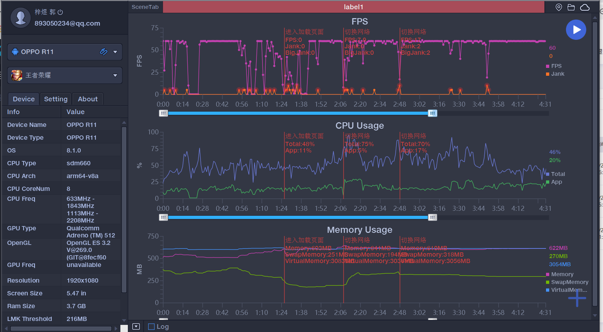    
    在网络角差的情况下，FPS会急速下降，导致画面及其卡顿。  
- CPU USage  
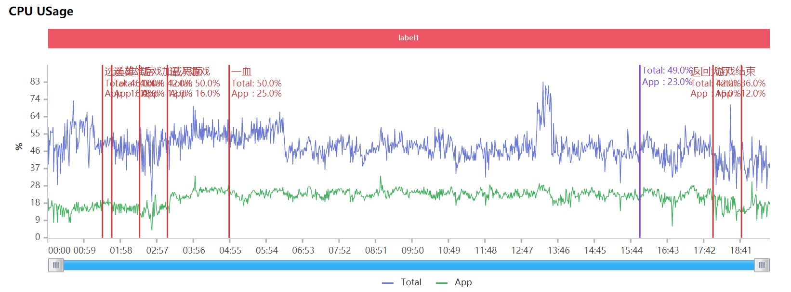  
CPU使用率指标正常，没有太大的波动变化。  
- CPU core Usage
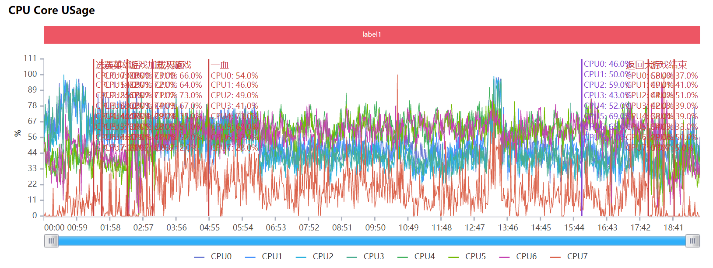   
同样地，CPU core Usage指标正常，没有太大的波动变化。   
- CPU Temperature
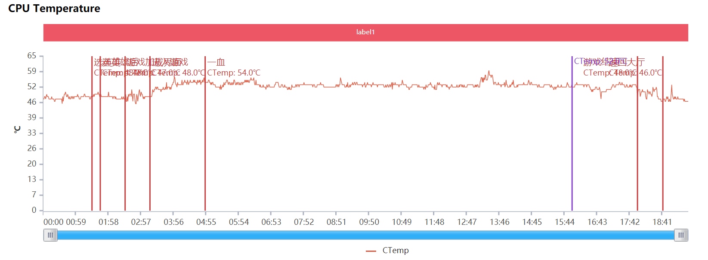   
CPU 温度指标在对局过程中确实比游戏外高一些。    
- Memory Usage
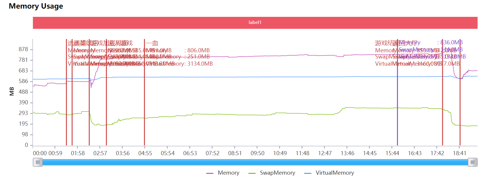   
内存使用在对局过程中也变高了，正常现象。  
- Network
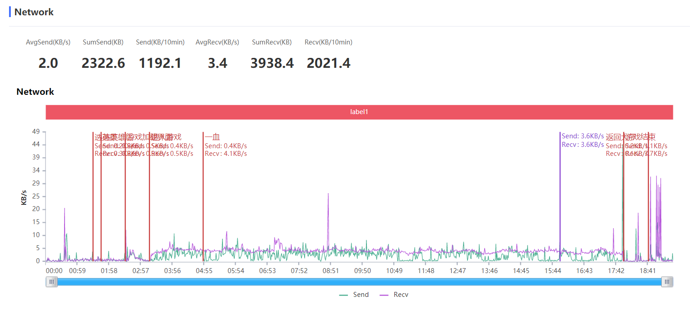   
- Battery
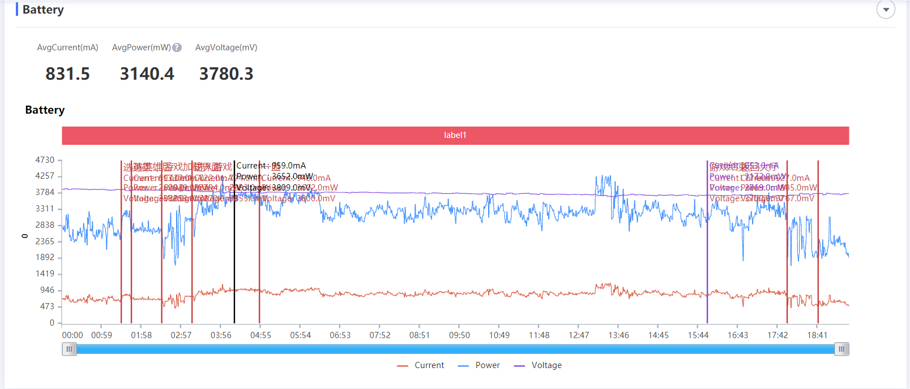   
网络和电量使用情况都十分稳定。  
- 还有许多其他的数据此处便不一一展示。详见`测试所得数据`文件夹中文件。